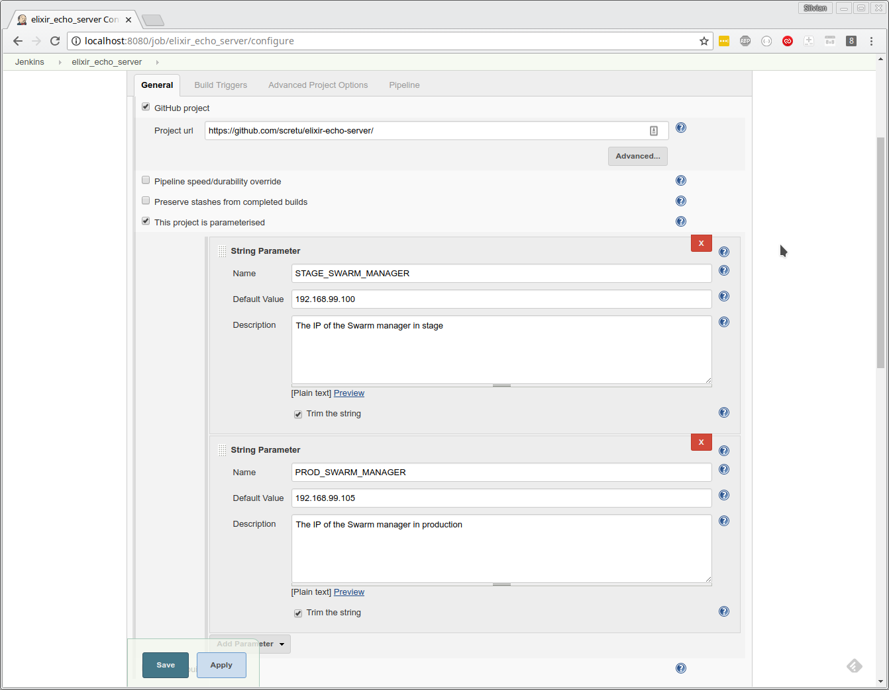
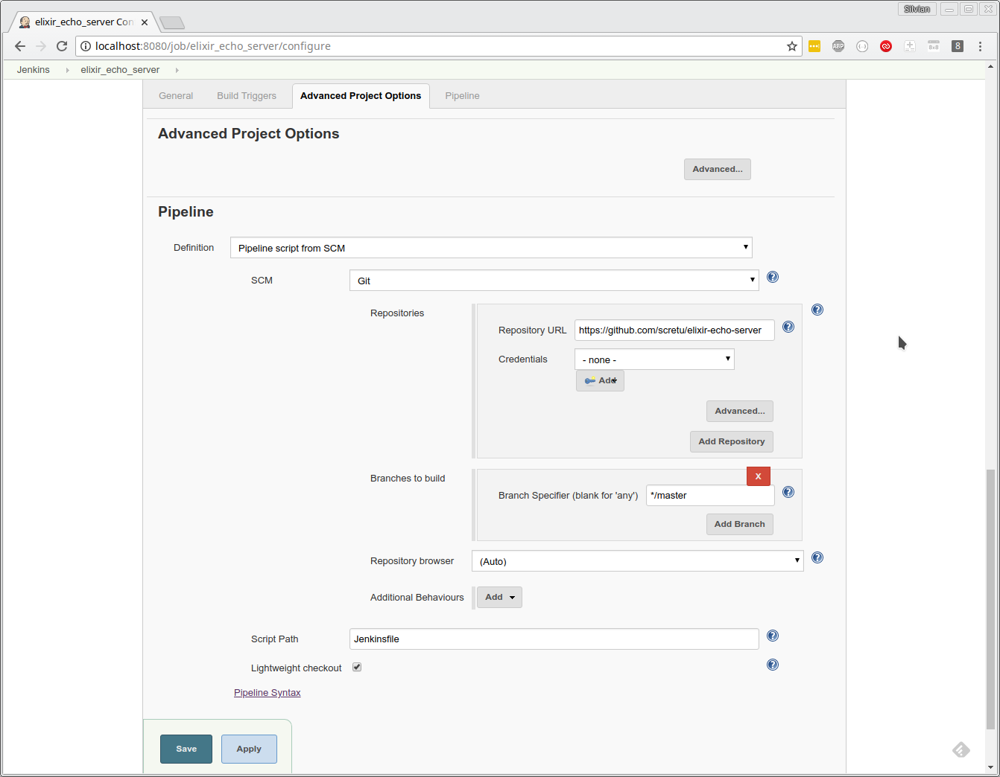
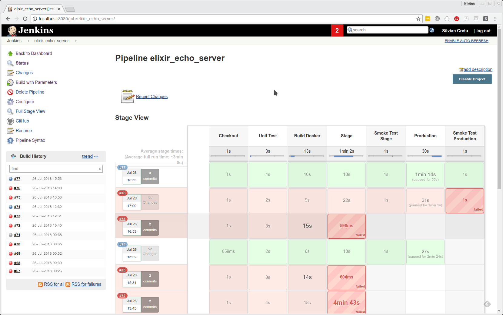

# Echo server in Elixir used in a CI/CD Pipeline

## CI

Continuous integration
Developers practicing continuous integration merge their changes back to the main branch as often as possible. The developer's changes are validated by creating a build and running automated tests against the build. By doing so, you avoid the integration hell that usually happens when people wait for release day to merge their changes into the release branch.

## CD as Continuous delivery

Continuous delivery is an extension of continuous integration to make sure that you can release new changes to your customers quickly in a sustainable way. This means that on top of having automated your testing, you also have automated your release process and you can deploy your application at any point of time by clicking on a button.

## CD as Continuous deployment

Continuous deployment goes one step further than continuous delivery. With this practice, every change that passes all stages of your production pipeline is released to your customers. There's no human intervention, and only a failed test will prevent a new change to be deployed to production.

## Pics or it didn't happen


[Source](https://www.atlassian.com/continuous-delivery/ci-vs-ci-vs-cd)

# Workshop

## CI / CD tools

[Bamboo](https://www.atlassian.com/software/bamboo)

[Travis CI](https://travis-ci.org/)

[Circle CI](https://circleci.com/)

[Team City](https://www.jetbrains.com/teamcity/)

[Jenkins](https://jenkins.io/)

etc

## Jenkins

On Linux

```sh
    docker run -p 8080:8080 -p 50000:50000 -v jenkins_home:/var/jenkins_home -v $(which docker):/usr/bin/docker -v /var/run/docker.sock:/var/run/docker.sock jenkins/jenkins:lts
```

Even better

```sh
    docker build -t myjenkins -f jenkins-Dockerfile .

    docker run --name myjenkins -p 8080:8080 -u root -d -v jenkins_home:/var/jenkins_home -v $(which docker):/usr/bin/docker -v /var/run/docker.sock:/var/run/docker.sock myjenkins:latest
```

On Windows

```sh
    docker run --name myjenkins -p 8080:8080 -d -v jenkins_home:/var/jenkins_home getintodevops/jenkins-withdocker:lts
```

## Docker Machine

On Linux run

```sh
    for n in `seq 1 2`; do docker-machine create --driver virtualbox stage$n; done
    for n in `seq 1 3`; do docker-machine create --driver virtualbox prod$n; done
```

On Windows, with Hyper-V

-   Configure networking first: <https://docs.docker.com/machine/drivers/hyper-v/#2-set-up-a-new-external-network-switch-optional>

```sh
    docker-machine create --driver hyperv --hyperv-virtual-switch "Primary Virtual Switch" stage1
    docker-machine create --driver hyperv --hyperv-virtual-switch "Primary Virtual Switch" stage2

    docker-machine create --driver hyperv --hyperv-virtual-switch "Primary Virtual Switch" prod1
    docker-machine create --driver hyperv --hyperv-virtual-switch "Primary Virtual Switch" prod2
    docker-machine create --driver hyperv --hyperv-virtual-switch "Primary Virtual Switch" prod3
```

## Docker Swarm

```sh
    export STAGE_IP=$(docker-machine ip stage1)
    echo $STAGE_IP
    docker-machine ssh stage1 "docker swarm init --advertise-addr $STAGE_IP"
    docker-machine ssh stage2 "docker swarm join --token SWMTKN-1-xxxxx $STAGE_IP:2377"

    docker-machine ssh stage1 "docker service create \
      --name=viz \
      --publish=8080:8080/tcp \
      --constraint=node.role==manager \
      --mount=type=bind,src=/var/run/docker.sock,dst=/var/run/docker.sock \
      dockersamples/visualizer"

    export PROD_IP=$(docker-machine ip prod1)
    echo $PROD_IP
    docker-machine ssh prod1 "docker swarm init --advertise-addr $PROD_IP"

    docker-machine ssh prod1 "docker service create \
      --name=viz \
      --publish=8080:8080/tcp \
      --constraint=node.role==manager \
      --mount=type=bind,src=/var/run/docker.sock,dst=/var/run/docker.sock \
      dockersamples/visualizer"
```

### Test the Swarms

Open a browser and point it to <http://$STAGE_IP:8080> and <http://$PROD_IP:8080> respectively

## Allow Jenkins to connect to Swarm managers

On the host, exec into the Jenkins container and create an SSH key pair

```sh
    docker exec -it myjenkins bash
```

Run this in the Jenkins container:

```sh
    ssh-keygen -f /var/jenkins_home/id_rsa -q -N ""
```

Exit the container and now run:

```sh
    docker-machine ssh stage1 "echo `docker exec myjenkins cat /var/jenkins_home/id_rsa.pub` >> .ssh/authorized_keys"
    docker-machine ssh prod1 "echo `docker exec myjenkins cat /var/jenkins_home/id_rsa.pub` >> .ssh/authorized_keys"
```

## Echo server in Elixir

### TCP Server

There is a Erlang module called gen_tcp that we'll use to for communicating
with TCP sockets.

In `lib/server.ex` we have the module responsible for that. It starts
a server

```elixir
def start(port) do
  tcp_options = [:binary, {:packet, 0}, {:active, false}]
  {:ok, socket} = :gen_tcp.listen(port, tcp_options)
  listen(socket)
end
```

then loop forever accepting income connections

```elixir
defp listen(socket) do
  {:ok, conn} = :gen_tcp.accept(socket)
  spawn(fn -> recv(conn) end)
  listen(socket)
end
```

when a client connects it spawns a new process and start receiving data
from the new made connection

```elixir
defp recv(conn) do
  case :gen_tcp.recv(conn, 0) do
    {:ok, data} ->
      :gen_tcp.send(conn, data)
      recv(conn)
    {:error, :closed} ->
      :ok
  end
end
```

### Running on the console

To run this open a console and start the server.

```sh
    $ iex -S mix
    iex> Echo.Server.start(6000)
```

The `-S mix` options will load your project into the current session.

#### In Docker

```sh
    docker build -t ees -f Dockerfile .
    docker run --rm --name ees -p 6000:6000 ees:latest
```

Connect using telnet or netcat and try it out.

### Unit tests

```sh
    $ mix test
```

#### In Docker

```sh
    docker build -t unit -f unit-Dockerfile .
    docker run --rm --name unit unit:latest
```

#### Running the smoke tests against a running server

```sh
    docker build -t test -f test-Dockerfile .
```

Running against one of the IPs of the current machine:

```sh
    docker run -e HOST=`hostname -I | cut -d' ' -f1` --rm --name test test:latest
```

Running against another server:

```sh
    docker run -e HOST="another server's IP" --rm --name test test:latest
```

## Jenkins Pipeline

-   Create a Pipeline job in Jenkins with
-   GitHub project <https://github.com/scretu/elixir-echo-server/>
-   2 build parameters: STAGE_SWARM_MANAGER and PROD_SWARM_MANAGER pointing to $STAGE_IP and $PROD_IP respectively
-   Definition: Pipeline script from SCM, where SCM is Git and Repository is <https://github.com/scretu/elixir-echo-server> and branch is `master`
-   It should look like this
    
    
-   Once you run the Pipeline, it should look like this:
    
-   But you will have to configure the Docker Hub credentials (see Pipeline stage `Build Docker`)
